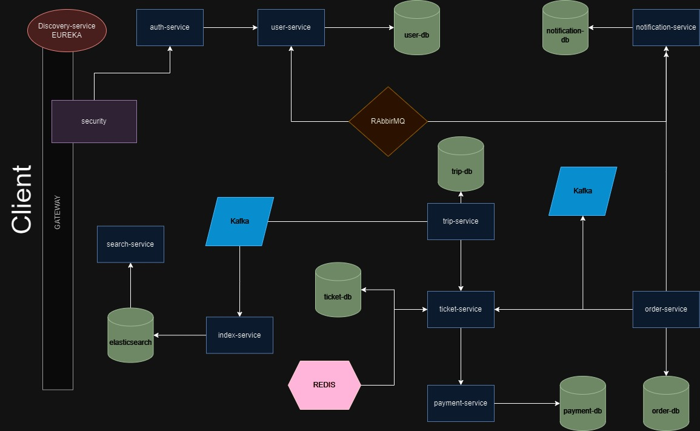

# Ticket Com

## Yolculuk uygulaması

### Kullanıcıya endpointleri

Register olmak için

    localhost:9090/api/v1/auth/register

Login işlemi için

    localhost:9090/api/v1/auth/login

Admin rolüne sahip kullanıcının sefer ekleme , çıkarma ve sefer için bilet bilgilerini öğrenebilmesi sağlayan endpoint

    localhost:9090/api/v1/trips/customer/**

Bilet leri görünütüleme, sepete ekleme, sepeti onaylama ve ödeme yapmak için kullanılan endpoint

    localhost:9090/api/v1/tickets/customer/**

User ın kendi bilgilerini gördüğü ve role ekleyip, çıkarma işlemlerini yaptığı endpoint

    localhost:9090/api/v1/users/customer/**

Seferlerin başlangıç şehiri, varış şehri gibi kriterlere göre seferleri arayabildiği endpoint

    localhost:9090/api/v1/search/**